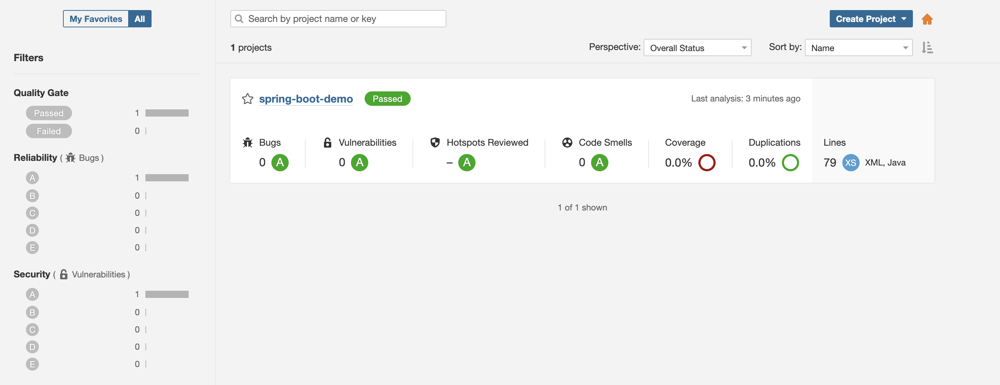
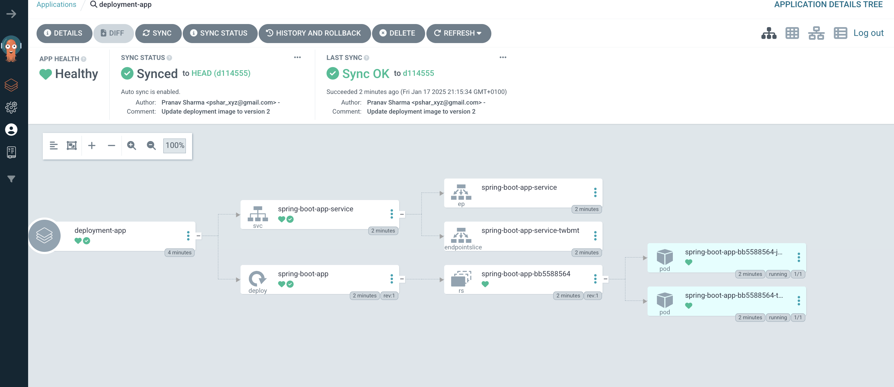

# Spring Boot Application CI/CD Pipeline

Welcome to the **Spring Boot Application CI/CD Pipeline** project! This repository demonstrates how I designed and implemented a Continuous Integration and Continuous Deployment (CI/CD) pipeline for a Spring Boot application using a variety of modern tools and technologies.

---

## Project Structure

```plaintext
.
├── Argo-CD.png                   # Image demonstrating ArgoCD deployment success
├── Manifests
│   ├── deployment.yml            # Kubernetes deployment manifest
│   └── service.yml               # Kubernetes service manifest
├── SonarQube.png                 # Image demonstrating SonarQube analysis success
└── spring-boot-app
    ├── Dockerfile                # Docker configuration file for containerizing the app
    ├── JenkinsFile               # Jenkins pipeline configuration
    ├── argocd-basic.yml          # Basic ArgoCD configuration file
    ├── pom.xml                   # Maven build configuration
    └── src
        └── main
            ├── java
            │   └── com
            │       └── abhishek
            │           └── StartApplication.java  # Main entry point for the Spring Boot app
            └── resources
                ├── application.properties          # Spring Boot configuration
                ├── static                          # Static assets
                │   ├── css
                │   │   └── main.css
                │   └── js
                │       └── main.js
                └── templates                       # HTML templates
```

---

## Tools and Technologies Used

### 1. **Jenkins**
   - **Purpose:** Automate the CI/CD process.
   - **Benefits:**
     - Allows for a fully automated pipeline, reducing human error and improving deployment speed.
     - Easily integrates with various tools like Docker and Kubernetes.

### 2. **Docker**
   - **Purpose:** Containerize the application for consistent and portable deployments.
   - **Benefits:**
     - Ensures that the application runs identically across different environments.
     - Simplifies dependency management and application scaling.

### 3. **SonarQube**
   - **Purpose:** Perform static code analysis to ensure code quality and security.
   - **Benefits:**
     - Detects code smells, vulnerabilities, and bugs early in the development lifecycle.
     - Provides actionable insights to improve code quality.

### 4. **Kubernetes**
   - **Purpose:** Manage deployment, scaling, and orchestration of containerized applications.
   - **Benefits:**
     - Ensures high availability and scalability of the application.
     - Simplifies management of microservices.

### 5. **ArgoCD**
   - **Purpose:** Automate Kubernetes deployments with declarative GitOps.
   - **Benefits:**
     - Enables continuous delivery by synchronizing Kubernetes manifests from Git repositories.
     - Provides a visual interface for monitoring deployments.

### 6. **Maven**
   - **Purpose:** Build and manage dependencies for the Spring Boot application.
   - **Benefits:**
     - Provides a standardized project structure.
     - Simplifies dependency management and builds.

### 7. **GitHub**
   - **Purpose:** Store the source code and manage version control.
   - **Benefits:**
     - Enables collaboration and code review.
     - Acts as a single source of truth for the application code and configuration.

---

## Key Features

1. **Automated Build and Deployment**:
   - From source code to a running application, everything is automated.
   - The pipeline ensures that new changes are built, tested, and deployed without manual intervention.

2. **Static Code Analysis**:
   - Integrated SonarQube analysis ensures code quality and security before deployment.

3. **Containerization**:
   - The application is packaged into a Docker container for consistent execution across environments.

4. **Kubernetes Deployment**:
   - The application is deployed and managed in a Kubernetes cluster for scalability and reliability.

5. **GitOps with ArgoCD**:
   - Ensures Kubernetes manifests are always in sync with the repository.

---

## Success Demonstrations

1. **SonarQube Analysis Success**:
   

2. **ArgoCD Deployment Success**:
   

---

## How to Run the Project

### Prerequisites
- Docker
- Kubernetes cluster (e.g., Minikube, EKS, GKE)
- Jenkins server
- SonarQube server
- ArgoCD instance
- Maven installed locally

### Steps
1. Clone the repository:
   ```bash
   git clone https://github.com/Pshar10/spring-boot-app-cicd-pipeline.git
   ```

2. Build the Docker image:
   ```bash
   cd spring-boot-app
   docker build -t pshar10/cicd-pipeline:latest .
   ```

3. Push the Docker image:
   ```bash
   docker push pshar10/cicd-pipeline:latest
   ```

4. Apply Kubernetes manifests:
   ```bash
   kubectl apply -f Manifests/deployment.yml
   kubectl apply -f Manifests/service.yml
   ```

5. Access the application:
   - Use the service's external IP to access the application in your browser.

---

## Future Enhancements
- Add unit test automation in the pipeline.
- Integrate a monitoring solution like Prometheus and Grafana.
- Implement canary deployments using Kubernetes.

---

## Repository
[GitHub Repository](https://github.com/Pshar10/spring-boot-app-cicd-pipeline)

---

Feel free to contribute or raise issues to improve this project! 🚀
